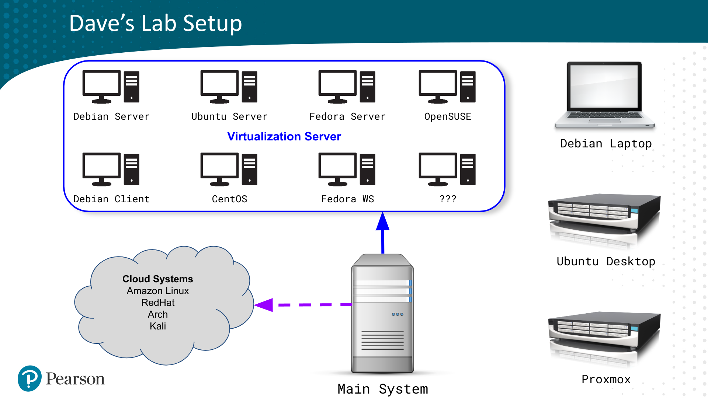

# Lab Setup 💻

Here are some suggestions for your lab setup as you watch this course.

To start, you should have at least two Linux systems, one that will act as a server and one that will act as a client. 

If you have questions, feel free to contact me at:

- Website: https://prowse.tech
- Discord: https://discord.com/invite/mggw8VGzUp

## Linux Recommendations 🐧

I recommend the following Linux distributions:

- Debian Server
- Debian Client

> Note: To run a proper Debian Server you would deselect all desktops during the installation. 

Debian download: https://www.debian.org/distrib/

Debian Installation Guide: https://www.debian.org/releases/bookworm/amd64/index.en.html

> Note: For step-by-step installations of various Linux distributions, including Debian and Fedora, see my website: https://prowse.tech/linux-installs/

If you can install other systems, do so. Examples include:

- Fedora Server
  
  Download: https://fedoraproject.org/en/server/download/

- Fedora Workstation

  Download: https://www.fedoraproject.org/en/workstation/download/

  > Note: Watch out for the minimum requirements of Fedora Workstation. They are a bit more hefty than other Linux distros.
  
  > Requirements: https://docs.fedoraproject.org/en-US/fedora/latest/release-notes/welcome/Hardware_Overview/

- Ubuntu Server
  
  Download: https://ubuntu.com/download/server

- Ubuntu Desktop
  
  Download: https://ubuntu.com/download/desktop

- OpenSuse Server
  
  Download: https://get.opensuse.org/

- CentOS Server

  Download: https://www.centos.org/download/

It sounds like a lot. But the more Linux systems you can install and work with, the more value you will have as a Linux Technician. Do what you can!

---

## Machine Options ⚙️

Now, how do you install them. You have a few options:

- Physical Machines (best option)
- Virtual Machines (almost as good)
- Cloud-based Machines (least recommended)

There's something to learn from each of these options, but the best method of learning is to use physical machines. For example, two laptops each equipped with wired and wireless network interface cards. Consider older equipment, that's where Linux really shines. You can find old, cheap (or free) laptops and PCs all over the place. Trust me. Consider Intel-based CPU/GPU devices as they tend to work better with Debian and other distros. 

If you don't have the resources, money, or space to run physical systems, consider virtual machines. As long as your system can handle them, you can run as many virtual machines as you want. 

I don't recommend cloud-based machines,but it is another option. If you do go this route, make sure that the machines are on the same subnet, can communicate with each other, and that you use the *console* to communicate with those machines. 

But again, the best ways to learn are physical machines and virtual machines.

---

## Virtualization Options 🖥️
There are a lot of options when it comes to virtualization platforms. The easiest option is VirtualBox, but there are many others. Here are some links to several of them:

- **VirtualBox**

  Download: https://www.virtualbox.org/wiki/Downloads

  Documentation: https://www.virtualbox.org/wiki/Documentation

  VirtualBox step-by-steps: https://prowse.tech/virtualbox/

- **Hyper-V** (Windows hosts only)

  Documentation: https://learn.microsoft.com/en-us/virtualization/

- **VMware Workstation**

  Download: https://www.vmware.com/products/workstation-pro/workstation-pro-evaluation.html

- **Parallels** (macOS only)

  Download: https://www.parallels.com/products/desktop/download/

- **KVM**

  Documentation: https://www.linux-kvm.org/page/Documents

  > Note: See my article on KVM for more: https://prowse.tech/kvm/

- **Proxmox**

  Download: https://www.proxmox.com/en/downloads

- **ESXi**

  Download: https://customerconnect.vmware.com/downloads/#all_products

I know, tons of options! Choose what works best for you. As I mentioned, VirtualBox can be an easy solution. Consider it if you are new to virtualization. 

---

## Dave's Lab Setup

Here's an example of my lab setup for the video course:

---
**Now... Go get your systems up and running!** 👍🏼

When you are done, you can check out [Lab 01](../labs/lab-01/lab-01_the-ip-command.md)
